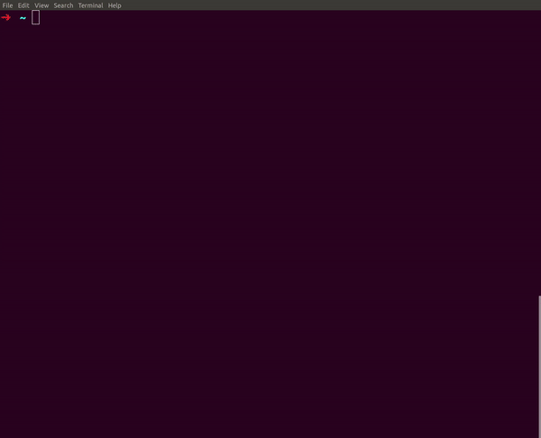

## DSU

Daily standup notes in terminal. A simple Golang tool for Unix based systems, to easily add and manage my daily standup notes. What did i do yesterday and what will i do today.




### How to use
```
git clone https://github.com/alexavlonitis/dsu

cd dsu
go build -o dsu *.go
cp dsu $HOME/bin
```

### Considerations

Based on the needs after using it, decide if it needs:
- Text searching
- Edit text
- More fetching options, like date range
